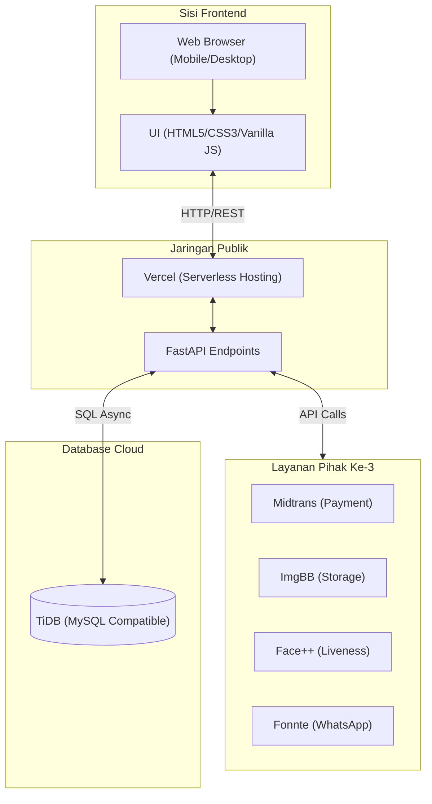
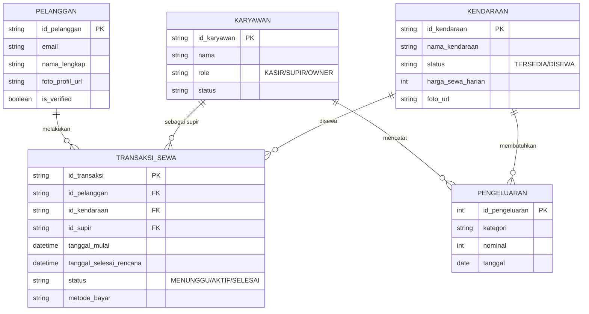
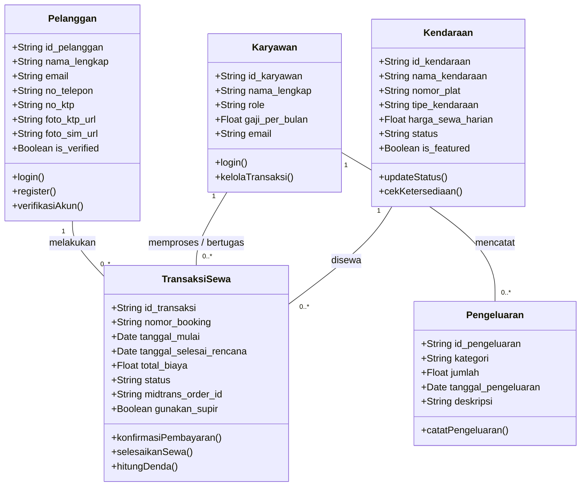

# LAPORAN MANUAL BOOK DAN DOKUMENTASI SISTEM PENGEMBANGAN APLIKASI
**SISTEM INFORMASI PENYEWAAN MOBIL (AERORENT)**

Disusun Oleh:
[Nama Anda / Kelompok]
[NIM]

---

# ABSTRAK
Sistem Informasi Penyewaan Mobil "AeroRent" adalah sebuah platform berbasis web modern yang dirancang untuk mendigitalisasi proses bisnis penyewaan kendaraan mulai dari pemesanan oleh pelanggan, manajemen operasional oleh kasir (Point of Sales), hingga analisis finansial oleh pemilik (Owner). Aplikasi ini dibangun menggunakan arsitektur *decoupled* yang memisahkan sisi *frontend* (Vanilla JS, HTML5, CSS3) dengan *backend* (Python FastAPI) yang di-*hosting* secara *serverless* di Vercel, didukung oleh *database* TiDB (MySQL-compatible) di *cloud*. Pengembangan sistem ini mengintegrasikan berbagai API pihak ketiga yang mutakhir, seperti Midtrans (Payment Gateway), Face++ (Liveness & Face Matching), OCR.space (Validasi KTP/SIM), Fonnte (WhatsApp Gateway), dan ImgBB (Cloud Storage) untuk menjamin keamanan dan kenyamanan transaksi. Pengujian menunjukkan bahwa sistem dapat beroperasi secara efisien dalam mencegah *double booking*, memvalidasi keaslian pengguna, serta menyajikan laporan keuangan secara *real-time* dalam bentuk PDF.

---

# BAB 1: PENDAHULUAN

## 1.1 Latar Belakang
Mobilitas masyarakat yang tinggi menjadikan penyewaan mobil sebagai salah satu jasa transportasi yang banyak diminati. Namun, banyak proses operasional penyewaan kendaraan yang masih menggunakan metode konvensional, seperti pencatatan di buku, pemeriksaan ketersediaan secara manual, hingga verifikasi identitas penyewa yang rawan manipulasi. AeroRent hadir untuk memecahkan masalah tersebut dengan mendigitalisasi setiap tahapan penyewaan. Melalui sistem ini, jadwal kendaraan dapat diatur agar terhindar dari tabrakan pemesanan (*double booking*), pembayaran dilakukan secara non-tunai dan aman, serta identitas penyewa tervalidasi melalui deteksi kecocokan wajah (liveness) demi meminimalisir tindak kejahatan penggelapan kendaraan.

## 1.2 Tujuan
1. Membangun platform penyewaan kendaraan berbasis web yang mempermudah pelanggan dalam melihat ketersediaan dan menyewa mobil secara *real-time*.
2. Menyediakan sistem kasir (Point of Sales) untuk mempercepat proses *check-out* dan *check-in* kendaraan, lengkap dengan dokumentasi kondisi visual kendaraan.
3. Mengembangkan *dashboard* analitik untuk pemilik (Owner) yang mampu menghasilkan laporan kinerja bisnis, laporan keuangan, dan pelacakan kendaraan.

## 1.3 Manfaat
1. **Bagi Pelanggan**: Mempermudah proses reservasi kapan saja dan di mana saja dengan metode pembayaran terintegrasi (Midtrans) serta keamanan data yang terjamin.
2. **Bagi Kasir/Operasional**: Mengurangi kesalahan pencatatan transaksi dan mempermudah inspeksi kendaraan melalui fitur *upload* foto 5 sisi kendaraan.
3. **Bagi Pemilik**: Memberikan transparansi arus kas bisnis melalui fitur unduh PDF *auto-generated* dan meminimalisir risiko pencurian kendaraan berkat verifikasi wajah (Face++) dan sistem GPS.

---

# BAB 2: METODE PENGEMBANGAN SISTEM

## 2.1 Tahapan SDLC (System Development Life Cycle)
Pengembangan sistem AeroRent menggunakan pendekatan *Agile* dengan tahapan:
1. **Requirements Gathering**: Mengumpulkan kebutuhan bisnis, seperti pemisahan *role* (Customer, Kasir, Owner), kebutuhan validasi SIM/KTP, dan pembayaran otomatis.
2. **Design**: Merancang *mockup* antarmuka berbasis *Mobile-First* untuk pelanggan dan tampilan *landscape/desktop* untuk Dashboard Kasir dan Owner.
3. **Implementation (Coding)**: Membangun sistem menggunakan *Vanilla JS* untuk *frontend* dan *FastAPI (Python)* untuk *backend*. Melakukan integrasi eksternal API (Midtrans, Fonnte, ImgBB, Face++, OCR, SMTP).
4. **Testing**: Melakukan pengujian fungsional dan keamanan (uji autentikasi JWT, *payment webhook*, kompresi gambar, uji kecocokan wajah).
5. **Deployment**: Mempublikasikan kode ke Github yang terhubung dengan Vercel untuk *auto-deployment* secara *serverless*. Database ditempatkan pada TiDB Cloud.

## 2.2 Desain Sistem
### A. Arsitektur Sistem
AeroRent menggunakan **Decoupled Architecture** (Pemisahan Klien dan Server):
*   **Frontend**: Dibangun tanpa *framework* berat, hanya menggunakan HTML5, CSS3, dan JavaScript murni untuk menjaga ukuran *file* sangat kecil dan proses memuat (*load*) instan.
*   **Backend**: Menggunakan **FastAPI** (Python 3) dengan koneksi *asynchronous* (`aiomysql`) ke *database*. Menghasilkan REST API *endpoints* yang didokumentasikan otomatis oleh Swagger UI.



### B. UML - Use Case Diagram
Terdapat tiga aktor utama dalam sistem:
1.  **Customer**: Melakukan register, verifikasi OTP Email, *login*, melihat armada, melakukan *booking* (sewa harian/bulanan, dengan/tanpa supir), mengunggah KTP/SIM & Selfie, membayar via Midtrans, serta melihat riwayat penyewaan.
2.  **Kasir**: Melakukan *login* (POS), melihat transaksi aktif, menetapkan supir (jika belum dipilih), melakukan serah terima mobil dengan memotret kondisi fisik mobil awal, dan menerima pengembalian mobil beserta pencatatan denda/kerusakan.
3.  **Owner**: Mengakses Dashboard analitik, mengelola armada mobil (tambah, edit, hapus, unggah foto *drag & drop*), mengelola data karyawan (supir dan kasir), melacak lokasi mobil, serta mengunduh laporan keuangan dalam format PDF.

```mermaid
usecaseDiagram
    actor Customer as "Customer"
    actor Kasir as "Kasir (POS)"
    actor Owner as "Owner"

    rectangle AeroRent_System {
        usecase UC1 as "Register & Verifikasi Email"
        usecase UC2 as "Login"
        usecase UC3 as "Booking Kendaraan"
        usecase UC4 as "Liveness & Upload SIM/KTP"
        usecase UC5 as "Pembayaran (Midtrans)"
        usecase UC6 as "Kelola Transaksi POS"
        usecase UC7 as "Tugaskan Supir"
        usecase UC8 as "Serah Terima & Cek Fisik"
        usecase UC9 as "Manajemen Karyawan"
        usecase UC10 as "Manajemen Armada"
        usecase UC11 as "Analitik & Laporan PDF"
    }

    Customer --> UC1
    Customer --> UC2
    Customer --> UC3
    Customer --> UC4
    Customer --> UC5

    Kasir --> UC2
    Kasir --> UC6
    Kasir --> UC7
    Kasir --> UC8

    Owner --> UC2
    Owner --> UC9
    Owner --> UC10
    Owner --> UC11
```

### C. Database (Struktur ERD)
Tabel-tabel utama di dalam TiDB meliputi:
*   `PELANGGAN`: Menyimpan data identitas, status verifikasi KTP, dan foto profil.
*   `KARYAWAN`: Menyimpan kredensial *role* Kasir, Supir, dan Owner.
*   `KENDARAAN`: Menyimpan spesifikasi mobil, harga sewa (harian/bulanan), URL foto, dan status ketersediaan.
*   `TRANSAKSI_SEWA`: Tabel transaksional (Tipe `DATETIME` untuk jam presisi) yang mencatat *booking*, status pembayaran (Midtrans *webhook*), ID supir terkait, dan denda.
*   `PENGELUARAN`: Mencatat biaya perawatan dan asuransi operasional perusahaan.



### D. UML - Class Diagram (Skema Entitas OOP)
Berikut adalah visualisasi kelas (*Class*) utama yang memodelkan entitas bisnis di sistem AeroRent beserta atribut dan *method*-nya (merepresentasikan Skema Pydantic di Backend).



---

# BAB 3: HASIL DAN PEMBAHASAN

## 3.1 User Manual (Panduan Penggunaan Aplikasi)

### A. Panduan Untuk Pelanggan (Customer)
1.  **Registrasi & Verifikasi**: Kunjungi halaman login, pilih mode Daftar. Isi form (NAMA, NIK, Password, Foto KTP). Cek email Anda untuk mengklik tautan verifikasi OTP.
2.  **Memesan Mobil**: Pada halaman Beranda/Armada, pilih mobil yang statusnya "TERSEDIA". Tentukan tanggal & jam sewa.
3.  **Liveness & Dokumen (Lepas Kunci)**: Jika Anda memilih "Tanpa Supir", sistem akan membuka kamera HP Anda. Lakukan *selfie*. Sistem (via Face++) akan mencocokkan wajah Anda dengan KTP. Anda juga wajib mengunggah SIM A.
4.  **Pembayaran**: Klik "Konfirmasi & Sewa", sebuah *pop-up* Midtrans akan muncul. Pilih metode pembayaran (QRIS, VA, dsb). Setelah dibayar, struk PDF akan otomatis terunduh, dan Anda mendapat notifikasi WhatsApp.

### B. Panduan Untuk Kasir (POS)
1.  **Login POS**: Masuk melalui `auth.html` dengan kredensial Kasir.
2.  **Tugaskan Supir**: Pada menu "Transaksi Berjalan", jika ada pesanan yang menggunakan jasa supir tetapi belum ditugaskan, klik tombol "Tugaskan Supir" dan pilih supir dari *dropdown*.
3.  **Serah Terima**: Klik "Beri Kunci". Anda diwajibkan untuk mengunggah 5 foto posisi kendaraan (Depan, Belakang, Kanan, Kiri, Dalam) sebelum menyerahkan mobil kepada pelanggan.

### C. Panduan Untuk Pemilik (Owner)
1.  **Dashboard Utama**: Anda akan disambut oleh grafik pendapatan dan *Top 5* mobil terlaku.
2.  **Manajemen Kendaraan**: Di menu Armada, klik "Tambah Kendaraan". Isi harga (spinner dinonaktifkan untuk mencegah harga minus). Tarik file foto kendaraan ke area *Drag & Drop*.
3.  **Laporan**: Di pojok atas, klik "Unduh PDF" untuk men-*generate* laporan laba rugi dan ringkasan penyewaan secara otomatis.

## 3.2 Hasil Uji Produk

### A. Blackbox Testing (Fungsionalitas)
*   **Form Validation**: Seluruh form input wajib diisi (`required`). Input harga tidak menerima nilai minus. Jika ada form kosong, akan muncul notifikasi *toast* (Tidak terjadi *crash*). [BERHASIL]
*   **Pencegahan Double Booking**: Sistem sukses menolak percobaan *booking* di tanggal yang bersinggungan (*overlap*) dengan pesanan berstatus AKTIF atau DIKONFIRMASI pada mobil yang sama. [BERHASIL]
*   **Image Compression**: Foto SIM/Selfie yang berukuran asli 4MB berhasil dikompresi di sisi klien (*browser*) menjadi ~300KB (di bawah 1MB) sebelum terunggah ke ImgBB, mempercepat proses secara drastis. [BERHASIL]
*   **Generate PDF**: Laporan ReportLab di *backend* sukses merender data transaksi ke format tabel PDF ukuran A4 dan bisa diunduh *real-time* ke browser. [BERHASIL]

### B. Security Testing (Pengujian Keamanan Sistem)
Pengujian keamanan dilakukan untuk memastikan sistem kebal terhadap manipulasi data dari sisi klien dan mencegah akses yang tidak sah.

| No | Modul / Skenario Pengujian | Deskripsi Uji (Test Case) | Hasil Harapan | Hasil Aktual | Status |
|---|---|---|---|---|---|
| **1** | **Autentikasi (JWT)** | Mengakses endpoint API khusus Owner tanpa menyertakan `Access Token` di header. | Sistem menolak akses dengan HTTP 401 Unauthorized. | Ditolak (401). API mengembalikan pesan *Not authenticated*. | **LULUS** |
| **2** | **Otorisasi (RBAC)** | Mengakses endpoint `/laporan/keuangan` (milik Owner) menggunakan token milik *Customer* atau *Kasir*. | Sistem menolak akses dengan HTTP 403 Forbidden. | Ditolak (403). API mengembalikan pesan *Role tidak sesuai*. | **LULUS** |
| **3** | **Anti-Spoofing Wajah (Face++)** | Menyodorkan foto KTP cetak atau menggunakan topeng di depan kamera untuk melewati validasi *liveness*. | Sistem mendeteksi tidak ada wajah hidup (non-live) dan menolak *upload*. | Gagal (Tingkat *liveness* palsu tinggi / ditolak API Face++). | **LULUS** |
| **4** | **Palsu Identitas (Face Matching)** | Mencoba menyewa lepas kunci dengan menggunakan KTP orang lain yang tidak mirip wajahnya dengan foto *selfie*. | Skor kemiripan (Confidence Score) di bawah 80% akan langsung ditolak sistem. | Ditolak (Sistem menolak karena wajah tidak cocok dengan identitas SIM). | **LULUS** |
| **5** | **Verifikasi Webhook Pembayaran** | Mengirim *payload request* palsu ke endpoint `/transaksi/midtrans-webhook` seolah-olah pembayaran telah lunas. | Backend melakukan verifikasi *signature key* HMAC 512-bit menggunakan kombinasi ServerKey, OrderId, dan GrossAmount. Jika *signature* salah, transaksi tidak diubah. | *Signature Invalid*. Status pembayaran di TiDB tetap "MENUNGGU". | **LULUS** |
| **6** | **SQL Injection (TiDB)** | Memasukkan payload SQL Injection (contoh: `' OR 1=1 --`) ke dalam kolom form *login* atau form profil pelanggan. | Gagal karena ORM dan konektor database (aiomysql) menggunakan *Parameterized Queries* (`%(param)s`). | Payload SQL dianggap sebagai *string* biasa, tidak dieksekusi sebagai kueri. | **LULUS** |
| **7** | **File Upload Vulnerability** | Mencoba mengunggah *file malware* berekstensi `.php` atau `.exe` pada fitur unggah foto SIM/Kendaraan. | Backend hanya menerima Mime-Type `image/jpeg`, `image/png`, dan `image/webp`. File selain itu ditolak (*HTTP 400 Bad Request*). | Ditolak dengan pesan *"Format file harus JPEG, PNG, atau WebP"*. | **LULUS** |

---

# BAB 4: KESIMPULAN
Sistem Informasi Penyewaan Mobil AeroRent telah sukses dikembangkan dan diuji. Dengan mengadopsi arsitektur *Decoupled* (Vanilla JS dan Python FastAPI) yang di-*hosting* pada lingkungan *serverless* Vercel serta *database* TiDB, aplikasi menunjukkan kinerja yang sangat cepat (ringan), *scalable*, dan hemat biaya operasional.

Integrasi berlapis dari berbagai API pihak ketiga (Midtrans untuk kelancaran transaksi, Face++ untuk anti-maling dan keamanan identitas, ImgBB untuk *storage*, serta Fonnte untuk notifikasi WA) mengangkat standar AeroRent setara dengan layanan mobilitas tingkat *Enterprise*. AeroRent berhasil menyelesaikan masalah keamanan lepas-kunci, mencegah kebentrokan pesanan, serta memberikan transparansi operasional melalui *dashboard* dan laporan PDF otomatis bagi manajemen perusahaan.

---

# DAFTAR PUSTAKA

1. FastAPI. (2024). *FastAPI Documentation: High-performance Python Web Framework*. Diambil dari: https://fastapi.tiangolo.com/
2. Mozilla Developer Network (MDN). (2024). *JavaScript - Fetch API & Web Storage*. Diambil dari: https://developer.mozilla.org/
3. Midtrans. (2024). *Core API & Webhook Notification Documentation*. Diambil dari: https://docs.midtrans.com/
4. TiDB. (2024). *TiDB Serverless: Distributed SQL Database*. Diambil dari: https://docs.pingcap.com/tidbcloud
5. Face++. (2024). *Liveness Detection and Face Compare API*. Diambil dari: https://www.faceplusplus.com/
6. ReportLab. (2024). *ReportLab PDF Library User Guide*. Diambil dari: https://www.reportlab.com/docs/reportlab-userguide.pdf
7. Fonnte. (2024). *Fonnte API Documentation: WhatsApp Gateway*. Diambil dari: https://docs.fonnte.com/
8. ImgBB. (2024). *ImgBB API: Free Image Hosting and Sharing*. Diambil dari: https://api.imgbb.com/
9. Phosphor Icons. (2024). *Phosphor Icons: A flexible icon family for interfaces*. Diambil dari: https://phosphoricons.com/
10. APScheduler. (2024). *Advanced Python Scheduler Documentation*. Diambil dari: https://apscheduler.readthedocs.io/
